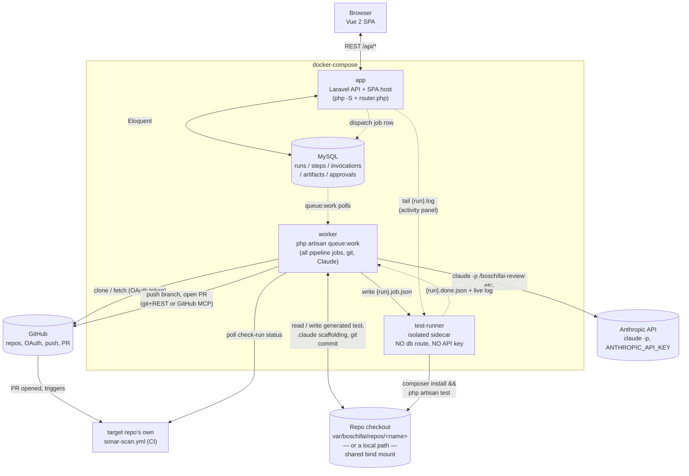

# Boschifai

Boschifai takes a plain-text requirement (or a "just improve coverage" instruction, or a
one-shot documentation request), runs it through AI-assisted analysis, and — after a human
approves — generates a test plan, test cases, and PHPUnit Feature test code, runs it for real
against the target repo, and (after a second human approval) opens a real GitHub pull request
and reports back a composite confidence score once CI concludes.

**Scope today:** one test type (PHPUnit Feature tests). Target repos are connected via
"Connect Repo" (`resources/js/pages/GithubSettingsPage.vue`) — either a GitHub account's repos
(OAuth), or a repo already checked out on disk. Each connected repo gets exactly ONE persistent
checkout that every Run against it shares and works on directly (see
`app/Services/Sandbox/RepoCheckoutManager.php`): a GitHub-connected repo is cloned into
`var/boschifai/repos/<name>` and kept in sync per run; a local repo is used at its own path and
is never cloned, reset, or otherwise force-modified. Because the checkout is shared, only one Run
per repo may be in flight at a time (`RunController::store()` rejects a second one with a 422).

## Architecture



- **`app`** — serves the Vue SPA and the JSON API. Never runs a pipeline job and never touches a
  repo checkout directly.
- **`worker`** — the only service that runs pipeline jobs: prepares the repo checkout, drives
  headless Claude Code, commits/pushes, polls CI. Carries Boschifai's own DB credentials as
  ambient environment, which is exactly why it must never run a *connected repo's* test command
  itself (see `test-runner` below).
- **`test-runner`** — a deliberately credential-less sidecar that runs a connected repo's own
  `composer install` + `php artisan test`. Split out from `worker` after a real incident: a
  connected repo's test suite inherited `worker`'s live DB env vars and its `RefreshDatabase`
  trait ran `migrate:fresh` against Boschifai's *own* database. `test-runner` has no `DB_*`/
  `ANTHROPIC_API_KEY` vars, no `.env`, and sits on its own Docker network with no route to `db` —
  not just "doesn't use" those credentials, structurally *can't* reach them. `worker` and
  `test-runner` talk over a shared volume via a tiny job-file protocol (`{run}.job.json` →
  `{run}.done.json`), not a socket or HTTP call — see `docker/test-runner/poll.php`'s docblock
  for the full protocol.
- **Repo checkout** — one persistent working copy per `RepoConfig`, shared by every Run against
  it (see `RepoCheckoutManager`). GitHub-connected: cloned/fetched with a per-connection OAuth
  token that's never written to disk. Local: the user's own path, mounted read-write into
  `worker`/`test-runner` and read-only into `app` (for browsing).

## How a pipeline run flows

See `app/Enums/RunState.php` for the authoritative state machine. The two human approval gates
(after gap analysis, after local execution) are the only manual steps — everything else is a
queued job (`app/Jobs/*.php`) chained automatically:

1. **Gap analysis** (`/boschifai-review`) — testability score + gaps.
2. **Test plan** (`/boschifai-test-plan`) — or, in coverage mode, test *design* plus a
   `RECOMMENDED_TARGET_FILE:` the pipeline extracts for itself, since coverage mode has no
   human-specified target file.
   → **Gate 1** (human approves/rejects the combined review + plan).
3. **Test case generation** (`/boschifai-test-cases`) — includes its own Task-tool validator;
   `NEEDS_FIXES` triggers up to `boschifai.claude.max_retries.test_case_generation` automatic
   re-attempts before blocking for a human.
4. **Code generation** (`/boschifai-gen-component`) — the actual PHPUnit Feature test file,
   written straight into the shared checkout.
5. **Local execution** — the generated test runs for real, via `test-runner` (see above). Failing
   tests can trigger **Fix failing tests**, which asks Claude to edit the file in place and
   re-runs this step.
   → **Gate 2** (human approves/rejects the generated code + real local pass/fail).
6. **Push** — branch + commit (exact-file-only, hard-asserted — never `git add -A`) + PR, either
   a fully deterministic git/REST flow or, if `GITHUB_MCP_PAT` is configured, a constrained
   Claude+GitHub-MCP invocation with the local commit already prepared and verified beforehand.
7. **CI polling** — watches the target repo's own existing `sonar-scan.yml` check run (no
   workflow files are touched) and computes the composite **confidence score**
   (`ConfidenceScoreCalculator`, weights in `config/boschifai.php`) from testability, test-case
   quality, local execution, and CI.

Two run types skip most of this entirely — **Standalone Actions** (`build_skills` /
`build_knowledge_base`, `RunStandaloneActionJob`) are a single Claude invocation that reads the
connected repo and writes one artifact, with no approval gate and no push at all.

## Connecting a repository

Two ways, both under "Connect Repo":

- **GitHub OAuth** — a classic OAuth App (`repo` scope, the same mechanism as VS Code's "Sign in
  with GitHub"), not a GitHub App installation. There's no native GitHub repo-picker for this
  flow; repo selection happens entirely in Boschifai's own UI after authorizing
  (`GithubConnectionController`). An organization can be excluded from the picker entirely
  (`ExcludedGithubOrganization`) and restored later.
- **Local repo** — browse and connect a repo already checked out on disk
  (`LocalRepoController`), confined to a single configured root
  (`BOSCHIFAI_LOCAL_REPOS_ROOT_PATH`) and resolved with `realpath()` so a browse request can't
  escape it — this app has no authentication layer at all, so that boundary matters.

Either way, `RepoConfig.copy_untracked_files` can list gitignored files (a private Composer
`auth.json`, etc.) to copy from the connected repo into the checkout, since git-tracked-only
checkouts and `.claude/` scaffolding regeneration (`boschifai init`) can't see them.

## Prerequisites

Two ways to run this: bare-host (needs everything below installed locally) or
[Docker](#running-with-docker) (needs only Docker — the `boschifai` CLI it depends on is vendored
into this repo at `docker/boschifai-cli/` and built as part of the image).

- PHP 8.2+, Composer
- Node.js + npm
- Git
- The `claude` CLI, installed and logged in (used non-interactively — no `ANTHROPIC_API_KEY`
  is required locally if `claude` already has its own stored credentials; production should
  source one via AWS SSM per `config/boschifai.php`'s TODO comments)
- The `boschifai` CLI, built from the source vendored at `docker/boschifai-cli/` (`cargo build
  --release --package boschifai-cli` from that directory) and on your `PATH` — `boschifai init`
  is what materializes `.claude/commands`/`.claude/skills` into the checkout; it's required even
  though `boschifai` itself doesn't do the generation. Docker mode builds this for you
  automatically; bare-host mode does not.
- A registered GitHub OAuth App (`BOSCHIFAI_GITHUB_OAUTH_CLIENT_ID`/`_SECRET`, see
  `.env.example`) — only needed for the GitHub-connected half of "Connect Repo"; connecting a
  repo already checked out on disk needs no OAuth App at all
- Whatever a connected repo's own test suite needs at runtime (its own `composer install` +
  `php artisan test` — see `LocalTestRunner`)

## Setup

```bash
composer install
npm install
cp .env.example .env
php artisan key:generate

# Set BOSCHIFAI_GITHUB_OAUTH_CLIENT_ID / _SECRET (see .env.example) before you'll be able to
# connect a real GitHub account and select repos from the UI.

php artisan migrate          # creates the sqlite DB — no seeding needed, repos come from Connect Repo
npm run build                # or `npm run dev` for a live-reloading Vite dev server
```

## Running the app

```bash
php artisan serve
```

Then open the URL it prints. The Vue app is a single-page app served from one Laravel route
(`routes/web.php`'s catch-all → `resources/views/app.blade.php`); the API lives under `/api/*`
(`routes/api.php`).

### The queue worker

Every pipeline step (gap analysis, test-case generation, code generation, local execution,
push, CI polling) runs as a queued job, so nothing happens until a worker is running:

```bash
php artisan queue:work
```

**Do not run `queue:work` with its default settings and assume it's fine** — Claude-invoking
jobs can take up to ~30 minutes (`config('boschifai.claude.timeouts.*')`), and Laravel's queue
worker kills jobs after 60 seconds by default. Every job that needs longer already overrides
its own `$timeout`/`$tries` properties (see `app/Jobs/*.php`), so a plain `php artisan
queue:work` respects those per-job overrides correctly — just don't override them back down
with a global `--timeout` flag lower than a job's own `$timeout`.

## Running tests

```bash
php artisan test
```

`phpunit.xml` runs tests against an in-memory sqlite database, isolated from your local dev
database (`database/database.sqlite`) — this was previously misconfigured (commented out, per
Laravel 11's own scaffold default) and would silently wipe real local data every time the test
suite ran. If you ever see your local Runs disappear after running tests, check that
`DB_CONNECTION`/`DB_DATABASE` are still uncommented in `phpunit.xml`.

## Running with Docker

`docker-compose.yml` runs four services: `app`, `worker`, `test-runner`, and `db` (MySQL) — see
[Architecture](#architecture) above for what each one does and why `test-runner` is isolated the
way it is.

```bash
docker compose up -d --build
```

That's it — `app` and `worker` each run their own `php artisan migrate --force` on every
start (idempotent, safe if both race on first boot; `restart: unless-stopped` retries the
rare loser). No seeding: visit `http://localhost:8420`, use "Connect Repo" to authorize a
GitHub account (or browse to a repo already checked out on disk) and pick repos.

The Dockerfile **compiles a Linux `boschifai` from source** as a build stage
(`docker/app/Dockerfile`'s `boschifai-builder` stage, source vendored at `docker/boschifai-cli/`)
— a `boschifai` binary built for your host is not portable into a Linux container, so this
happens automatically on every image build with no path configuration needed.

Set these in `.env` before building (see `.env.example` for the full list with explanations):

- `ANTHROPIC_API_KEY` — required for headless `claude -p` to authenticate inside a container
  (there's no interactive login possible there). Get one from the Claude Console.
- `BOSCHIFAI_GITHUB_OAUTH_CLIENT_ID` / `BOSCHIFAI_GITHUB_OAUTH_CLIENT_SECRET` — identify this
  app's GitHub OAuth App (a one-time, out-of-band registration — see `.env.example`'s comment
  for the exact steps). Without these, connecting via GitHub 422s immediately with a clear
  message — connecting a local repo doesn't need these at all.
- `BOSCHIFAI_LOCAL_REPOS_ROOT` — the host directory "Connect Repo"'s local-filesystem section
  is allowed to browse (bind-mounted into `app` read-only, into `worker`/`test-runner`
  read-write).
- `GITHUB_MCP_PAT` — optional; only needed for the opt-in GitHub-MCP push path (see
  `config/boschifai.php`'s `github_mcp` docblock). Leave blank to keep the default deterministic
  push path.

### `auth.json` and other gitignored files

A private Composer package pulled over SSH and authenticated via a gitignored `auth.json` is a
real, previously-hit failure mode — like `.claude/commands`, such files are invisible to a fresh
GitHub-connected checkout (git only carries tracked files), and `composer install` fails without
them. `RunWorkspaceManager` copies whatever's listed in a `RepoConfig` row's own
`copy_untracked_files` column from `git_remote_path` into the checkout (a no-op for a local repo,
whose checkout already has these files for real). There's no UI for this yet — set it directly on
the row (`php artisan tinker`) if a connected repo needs it.

## Reporting

Under the sidebar's "Reporting" section — all read-only views over existing data, no separate
write path:

- **Confidence Reports** — every run's composite score and its breakdown.
- **Coverage Reports** — generated test files, their local pass/fail, and (where available) an
  HTML coverage report per class.
- **Test History** — every locally-executed test, across every run.
- **Token Usage** — every headless Claude invocation this calendar month, summed and itemized
  (`UsageController`, `claude_invocations` table) — this is the *entire* `ANTHROPIC_API_KEY`
  spend, since that table is written by exactly one code path
  (`StepExecutionService`/`HeadlessClaudeInvoker`) and nothing else ever authenticates against
  that key. Also linked directly from the header badge.

## Troubleshooting

If a submitted requirement seems to do nothing, or the page is blank/broken, check these in
order — each was a real bug hit once, fixed, and left here so the fix isn't lost:

1. **Run detail page shows nothing changing.** Confirm a worker is actually processing jobs:
   bare-host, is `php artisan queue:work` running in a terminal? Docker, does `docker compose
   ps` show `worker` as `Up` (not restarting)? The live activity panel on the run page should
   now say explicitly "Queued, but no worker has picked this up yet" if this is the issue — if
   you still see a blank/static page instead, that's a regression in that feature, not this
   root cause.
2. **Blank white page, nothing renders.** Open the browser console. `Failed to load module
   script ... MIME type of "text/html"` means static assets are being routed through the SPA
   catch-all instead of served directly — check `docker-compose.yml`'s `app` command still uses
   `docker/app/router.php`, not `public/index.php` directly or a bare `artisan serve`.
   `Cannot read properties of undefined (reading 'dispatch')` means Vuex didn't attach —
   confirm `node_modules/vuex/package.json` says a `3.x` version, not `4.x` (Vuex 4 targets Vue
   3 and silently no-ops against Vue 2's `Vue.use()` API).
3. **Docker web app and worker seem to disagree about what data exists.** Confirm
   `docker-compose.yml`'s `app`/`worker` commands invoke `php -S` directly, not `php artisan
   serve` — in this stack, `artisan serve`'s spawned child process was confirmed to silently
   ignore the container's `DB_CONNECTION=mysql` override and fall back to `.env`'s committed
   `sqlite` value, so requirements submitted through the web UI landed in a different database
   than the one the worker polls for jobs.
4. **A Claude step fails instantly with `"Not logged in · Please run /login"`.**
   `ANTHROPIC_API_KEY` isn't reaching the worker — the containerized `claude` CLI has no
   interactive login, unlike your host machine's. Set it in `.env` and restart the worker.
5. **A Claude step fails instantly with `"Credit balance is too low"`.** Not a code issue — the
   Anthropic account behind that API key needs credits/billing set up in the Claude Console.
6. **Local execution fails with `"the test-runner sidecar did not report back..."`.** Check
   `docker compose ps test-runner` — if it's not `Up`, `worker` has no way to actually run the
   generated test. `test-runner` and `worker` only ever talk through the shared
   `boschifai_test_jobs` volume, not a network call, so this is the one failure mode a plain
   `curl` against `worker` would never catch.
7. **"I have to click Connect GitHub/repo a couple of times before anything happens."** Fixed
   once already: the redirect to GitHub must be a plain `<a href>`/top-level navigation
   (`GithubOAuthRedirectController`, registered in `routes/web.php`), not a JS `fetch` that hands
   a URL back for `window.location.href` to follow — browsers can silently block that second
   navigation once it's on the other side of an `await`, since it no longer looks like a direct
   result of the click.

## What's not wired up yet

These are real TODOs, not silently-stubbed behavior — the code paths that need them fail with
a clear error rather than pretending to succeed:

- **GitHub push/PR/CI polling** — works once a repo is connected via "Connect Repo" (a classic
  OAuth App, see `GithubOAuthService`); `BOSCHIFAI_GITHUB_OAUTH_CLIENT_SECRET` should be sourced
  from AWS SSM in production, never a plain `.env` value.
- **Detecting a revoked/uninstalled GitHub connection** — there's no webhook receiver, so a
  user revoking access on GitHub's side (github.com/settings/applications) isn't noticed here
  until the next attempted use of that connection fails.
- **Claude sandboxing** — `HeadlessClaudeInvoker` execs `claude` directly inside `worker`, with
  the same DB/queue credentials as everything else in that container (local test execution was
  split out into `test-runner` specifically *because* of this kind of credential-leak risk, but
  the Claude invocation itself hasn't had the same treatment). Production should run it in a
  more locked-down container with network egress restricted to `api.anthropic.com` and no
  GitHub/AWS/DB credentials present — today's Docker setup does not attempt this isolation.
- **No authentication on this app at all** — no login, nothing gating `/api/*`. The local-repo
  browse endpoint is deliberately root-confined for this reason (see
  [Connecting a repository](#connecting-a-repository)), but that's a mitigation for one endpoint,
  not a substitute for real auth on the whole app.
- **Single global concurrency limit, not a real queue/lock** — only one Run per repo may be in
  flight (enforced in `RunController::store()`), a deliberate simplification the shared-checkout
  design accepts rather than solves for; fine for today's usage, would need real
  locking/isolation to support real concurrent runs against the same repo.

## Project layout

- `app/Models` / `database/migrations` — the Run state machine and its related records (steps,
  Claude invocations + token usage, artifacts, human approvals, execution/CI results)
- `app/Enums` — `RunState` (the pipeline state machine), `RunType` (requirement / coverage /
  build_skills / build_knowledge_base), `RunStepKey`
- `app/Services/Sandbox` — `RepoCheckoutManager` (one persistent checkout per repo: clone/fetch
  for GitHub-connected, untouched for local) and `RunWorkspaceManager` (per-run prep: `boschifai
  init`, untracked-file copying, git-status baselines)
- `app/Services/Pipeline` — `StepExecutionService` (the one place every Claude-driven job creates
  its `RunStep`/`ClaudeInvocation` rows and collects artifacts — not duplicated four times) and
  `CancellationChecker`
- `app/Services/ClaudeRunner` — headless Claude Code invocation, prompt building, transcript
  parsing (including token/cost usage, see Reporting above)
- `app/Services/ArtifactCollection` — git-status-diff based artifact discovery, testability score
  parsing, coverage-mode's codebase/execution-recipe parsing
- `app/Services/TestExecution` — `LocalTestRunner` (talks to the `test-runner` sidecar via a
  job-file protocol) and `JunitXmlParser`
- `app/Services/Github` — branch/commit/PR/CI-polling, plus the OAuth App integration
- `app/Services/Confidence` — the composite confidence score calculator
- `app/Jobs` — one queued job per pipeline stage (see [How a pipeline run flows](#how-a-pipeline-run-flows))
- `resources/js` — the Vue 2 frontend (components under `components/`, pages under `pages/`,
  Vuex modules under `store/modules/`)
- `docker/app` — the main image (Dockerfile, `router.php`, GitHub MCP config)
- `docker/test-runner` — `poll.php`, the sidecar's entire job (deliberately plain PHP, no
  Laravel bootstrap — see its own docblock for why)
- `docker/boschifai-cli` — the vendored Rust source for the `boschifai` CLI
- `docker-compose.yml` — see [Running with Docker](#running-with-docker)
